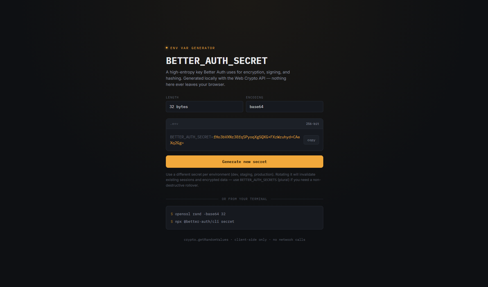

## About

This is a self hosted key generator. You can use it to make 32,48,64 byte key in base64 and hex

## How to install

on casaos or zimaos do those things

1. use the [Secret Generator compose.yaml] on App Store → "Install a Customized App" → Docker Compose tab

2. paste the index.html file on file like this /DATA/AppData/secret-generator/index.html

3. enjoy

# Shadow out

## Screenshots

  

   
